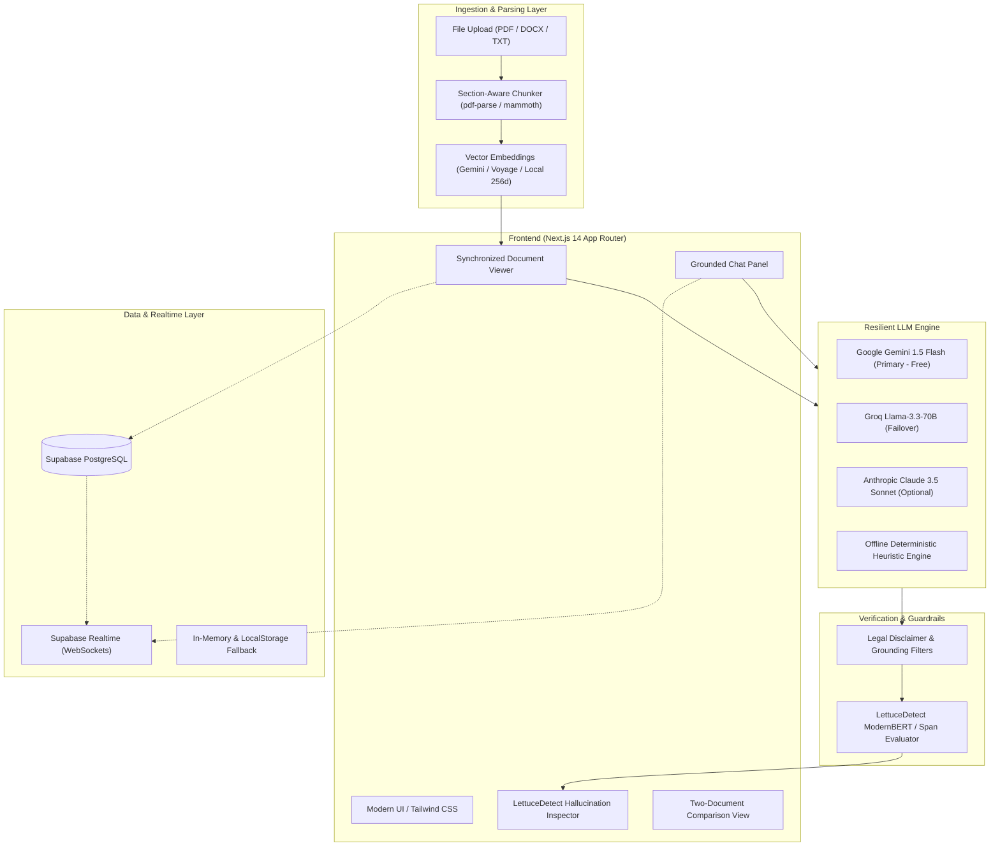

# ClauseWise — GenAI Legal Document Assistant

<div align="center">

[](https://nextjs.org/)
[](https://www.typescriptlang.org/)
[](https://tailwindcss.com/)
[](https://supabase.com/)
[](https://aistudio.google.com/)
[](https://groq.com/)
[](https://huggingface.co/KRLabsOrg/lettucedect-base-modernbert-en-v1)
[](./LICENSE)

**Empowering non-lawyers to understand, compare, verify, and negotiate complex legal agreements with confidence.**

[Features](#-key-features) • [Architecture](#-architecture--data-flow) • [Quick Start](#-quick-start) • [Testing](#-automated-testing) • [Database Setup](#-free-supabase-database-setup) • [Hallucination Audit](#-lettucedetect-hallucination-audit) • [Environment Variables](#-environment-variables) • [Disclaimer](#-legal-disclaimer)

</div>

---

> [!IMPORTANT]
> **Legal Disclaimer:** ClauseWise is an informational and document-comprehension tool, **NOT** a law firm or a substitute for professional legal advice. It does not judge legal enforceability, create an attorney-client relationship, or provide formal legal recommendations. Always consult a qualified attorney for legal counsel.

---

## 📌 Overview

Legal agreements are notoriously drafted by attorneys for attorneys—dense with impenetrable boilerplate, opaque cross-references, hidden indemnities, asymmetric liability caps, and unfavorable termination clauses. Non-lawyers (freelancers, startup founders, procurement leads, and consumers) routinely sign contracts without fully understanding their exposure.

**ClauseWise** levels the playing field. It ingests complex contracts (PDF, DOCX, text), breaks them down using section-aware parsing, translates each clause into 9th-grade plain English, calculates factual risk levels, allows grounded RAG Q&A with interactive source citations, cross-examines revisions side-by-side, and conducts token-level hallucination audits using ModernBERT.

---

## ✨ Key Features

### 1. 📑 Section-Aware Document Parsing & Ingestion
- **Multi-Format Support:** Drag-and-drop or upload PDF files, Word documents (`.docx`), or paste raw contract text.
- **Structural Integrity:** Automatically detects numbered clauses, legal hierarchies (`Section 1.1`, `Article IV`, `Subsection (a)`), headings, and approximate page numbers.
- **Preloaded Sample Contracts:** Instant one-click testing with preloaded contracts:
  - *Standard SaaS Master Services Agreement (MSA v1.0)*
  - *Vendor Counter-Proposal (MSA v2.1)*
  - *Mutual Non-Disclosure Agreement (NDA)*

### 2. 🔍 Synchronized Clause Simplification & Risk Categorization
- **Split-Screen Editorial View:** Read the authentic contract in high-legibility editorial serif typography alongside simplified clause cards.
- **Plain-Language Translations:** Distills convoluted legalese down to clear, 9th-grade reading level summaries while strictly preserving figures, monetary amounts, and deadlines verbatim.
- **Objective Risk Assessment:** Factual categorization into `LOW`, `MEDIUM`, or `HIGH` risk tags, accompanied by factual justifications (e.g., unilateral indemnities, automatic renewals without notice) rather than manufactured anxiety.
- **Key Terms Extraction:** Flags vital defined terms, capital thresholds, and notice durations.

### 3. 💬 Grounded RAG Chat with Interactive Citations
- **Strict Retrieval-Augmented Generation:** Strict system prompts restrict responses exclusively to verified excerpts retrieved from the document.
- **Direct Mathematical Answers:** Computes concrete values first (e.g., late fees across specific date intervals) before citing source sections.
- **Clickable Live Citations:** Clicking on citations automatically scrolls the document viewer to and highlights the referenced clause in real-time.
- **Built-in Guardrails:** Explicitly acknowledges when a topic is absent from the contract rather than inventing terms.

### 4. 🥬 LettuceDetect ModernBERT Span-Level Hallucination Audit
- **Deep Factual Verification:** Audits AI responses character-by-character against retrieved contract excerpts using `KRLabsOrg/LettuceDetect` (ModernBERT) or an intelligent built-in fallback evaluator.
- **Transparent Audit Metrics:**
  - **Fidelity Score (0–100):** Comprehensive faithfulness rating.
  - **Hallucination Rate (%):** Percentage of ungrounded or speculative tokens.
  - **Risk Rating:** Categorized as `LOW`, `MODERATE`, `HIGH`, or `CRITICAL`.
  - **Visual Span Highlighting:** Highlights exact unsupported phrases with confidence scores and catalogs supported claims.

### 5. ⚖️ Semantic Two-Document Comparison
- **Cross-Version Diffing:** Align and contrast two contracts or negotiation drafts (e.g., Original Draft vs. Redlined Vendor Proposal).
- **Semantic Nearest-Neighbor Matching:** Pairs corresponding clauses even when section numbering, headings, or structural order differ.
- **Strategic Impact Analysis:** Classifies clause shifts by who they benefit: `FAVORS_A`, `FAVORS_B`, `NEUTRAL`, or `SIGNIFICANT_CHANGE`.
- **Gap Detection:** Detects provisions present exclusively in Document A or Document B.

### 6. 📝 Realtime Clause Annotations & Notes
- **Collaborative Notes:** Attach private review notes and attorney questions directly to individual clauses.
- **Supabase Realtime Sync:** Instant WebSocket broadcast keeps notes synchronized across multiple tabs and devices without page refreshes.

### 7. 📋 Action Checklist & Negotiation Planner
- **Attorney Question Generator:** Curates targeted questions to ask your legal counsel during reviews.
- **Critical Notice Calendar:** Isolates hard deadlines, cure periods, renewal windows, and termination triggers.
- **Negotiation Leverage Items:** Flags high-risk clauses that warrant counter-proposals or edits.
- **Multi-Format Export:** Download your checklist as formatted Markdown, plain text (`.txt`), or print-ready PDF.

---

## 🏗️ Architecture & Data Flow



---

## 🛠️ Technology Stack

| Layer | Technologies | Description |
| :--- | :--- | :--- |
| **Framework** | [Next.js 14](https://nextjs.org/) (App Router), [React 18](https://react.dev/) | High-performance server and client rendering |
| **Language** | [TypeScript 5](https://www.typescriptlang.org/) | End-to-end type safety |
| **Styling** | [Tailwind CSS 3](https://tailwindcss.com/), [Lucide React](https://lucide.dev/) | Responsive modern design, custom typography, glassmorphism |
| **Database** | [Supabase](https://supabase.com/) (PostgreSQL) | Document storage, chunk metadata, chat history, notes |
| **Realtime** | [Supabase Realtime](https://supabase.com/docs/guides/realtime) | WebSocket pub/sub for cross-tab collaboration |
| **Primary LLM** | [Google Gemini 1.5 Flash](https://ai.google.dev/) | Fast, cost-free analysis via Google AI Studio |
| **Fallback LLM** | [Groq SDK](https://groq.com/) (`llama-3.3-70b-versatile`) | Ultra-fast inference failover if primary rate-limits |
| **Premium LLM** | [Anthropic Claude SDK](https://docs.anthropic.com/) | Claude 3.5 Sonnet for high-precision legal breakdown |
| **Embeddings** | Voyage AI, Gemini Embeddings, Local Vectorizer | 256-dimensional semantic term vectors with cosine similarity |
| **Hallucination Detection** | [LettuceDetect](https://github.com/KRLabsOrg/LettuceDetect) & ModernBERT | Span-level token audit against grounding excerpts |
| **Parsers** | `pdf-parse`, `mammoth` | Accurate section extraction for PDF and Word DOCX |

---

## 🚀 Quick Start

### Prerequisites
- **Node.js**: v18.18.0 or higher
- **npm**, **pnpm**, or **yarn**
- *(Optional)* **Python 3.10+** (only if you wish to run the local PyTorch LettuceDetect ModernBERT model)

### 1. Clone & Install Dependencies

```bash
git clone https://github.com/your-username/clausewise.git
cd clausewise
npm install
```

### 2. Configure Environment Variables

Copy the provided `.env.example` file to `.env.local`:

```bash
cp .env.example .env.local
```

Edit `.env.local` with your preferred credentials:

```ini
# --- Free AI Tier (Recommended) ---
GEMINI_API_KEY=your_gemini_api_key_here
GROQ_API_KEY=your_groq_api_key_here

# --- Optional Supabase Configuration ---
NEXT_PUBLIC_SUPABASE_URL=https://your-project.supabase.co
NEXT_PUBLIC_SUPABASE_ANON_KEY=your-supabase-anon-key-here

# --- UI Settings ---
NEXT_PUBLIC_SHOW_BYOK_BUTTON=true
```

> **Note:** If no API keys or Supabase credentials are provided, ClauseWise **still operates seamlessly** using its built-in local vectorizer, offline heuristic intelligence engine, and in-memory database!

### 3. Run the Development Server

```bash
npm run dev
```

Open [http://localhost:3000](http://localhost:3000) in your browser.

---

## 🧪 Automated Testing

ClauseWise includes an automated test suite built with **Jest** and **React Testing Library** verifying the core legal intelligence pipeline (**Parsing → Retrieval → Generation → API Guardrails**):

```bash
# Run the entire test suite
npm test

# Run tests in watch mode during development
npm test -- --watch

# Run a specific test suite
npm test __tests__/parsing.test.ts
npm test __tests__/embeddings_vectorstore.test.ts
npm test __tests__/risk_parser.test.ts
npm test __tests__/api_routes.test.ts
```

### Covered Test Suites:

1. **Document Parsing (`__tests__/parsing.test.ts`)**:
   - Section-aware chunking preserving hierarchy (`Section 1.1`, `Article I`, `(a)`).
   - Accurate section title extraction and order sequence tracking.
   - Preamble and recitals detection.
2. **Retrieval & Vector Store (`__tests__/embeddings_vectorstore.test.ts`)**:
   - Cosine similarity computation across unit, orthogonal, and opposite vectors.
   - Semantic ranking of legal clauses against queries (e.g. indemnity queries).
   - Embedding caching verification (chunks with existing vectors are never re-embedded).
3. **Risk Categorization JSON Parser (`__tests__/risk_parser.test.ts`)**:
   - Robust JSON extraction from raw LLM responses with markdown fences or conversational preambles.
   - Mapping to `{ category, plain_summary, risk_level, risk_reason, key_terms }`.
   - Guardrail safety filter rewrite verification (rewriting prescriptive advice to advisory language).
4. **API Route Guardrails (`__tests__/api_routes.test.ts`)**:
   - `/api/chat` integration: verified shaped response with grounded answers, live citations, and hallucination audits.
   - Sanitized error handling: verified zero stack traces, file paths, or private API keys leak on provider failure.
   - `/api/upload` validation: verified strict rejection of invalid executable types (415) and corrupted magic headers (400).

ClauseWise features a dual persistence architecture. You can connect a free Supabase PostgreSQL database for persistent cross-session storage and real-time syncing:

1. Create a free account at [Supabase](https://supabase.com) and create a new project.
2. In your Supabase Dashboard, navigate to the **SQL Editor** (`/project/_/sql`).
3. Open [`supabase-schema.sql`](./supabase-schema.sql) in this repository, copy its entire contents, paste it into the SQL Editor, and click **Run**.
4. In your Supabase Project Settings under **API**, copy your:
   - **Project URL**
   - **Anon / Public Key**
5. Add them to `.env.local` or click **"Connect Supabase / Free Key"** in the ClauseWise top navigation bar to configure it directly in your browser.

### Schema Overview

- `documents`: Stores raw text, filenames, file types, and metadata stats.
- `clauses`: Stores section-partitioned chunks with order numbering and page indicators.
- `analyses`: Stores plain summaries, risk ratings (`LOW`, `MEDIUM`, `HIGH`), and defined terms.
- `chat_messages`: Stores user and assistant dialogues, grounded citations, and hallucination audits.
- `clause_notes`: Stores real-time collaborative annotations and attorney questions.
- `supabase_realtime`: Publication enabling real-time WebSocket subscriptions for `chat_messages` and `clause_notes`.

---

## 🥬 LettuceDetect Hallucination Audit

ClauseWise incorporates span-level hallucination detection to ensure legal summaries and Q&A answers never fabricate terms, dates, or obligations.

### How It Works:
1. **Context Extraction:** Retrieved document excerpts are compiled as the ground truth.
2. **Span Scoring:** The system evaluates every factual assertion, dollar amount, date, and condition against the context.
3. **Execution Modes:**
   - **Local Calibrated Fallback (Default):** Runs immediately in Node.js/TypeScript with zero external dependencies.
   - **Python ModernBERT Model:** If Python and `lettucedetect` are installed, the background runner executes `scripts/lettucedetect_service.py` using `KRLabsOrg/lettucedect-base-modernbert-en-v1`.

### (Optional) Enabling the ModernBERT Python Model:

```bash
pip install lettucedetect torch transformers
```

The application automatically invokes `scripts/lettucedetect_service.py` when available and falls back gracefully if the Python environment is not configured.

---

## ⚙️ Environment Variables

| Variable | Required | Description |
| :--- | :---: | :--- |
| `GEMINI_API_KEY` | Optional | Google AI Studio Gemini API Key (100% free tier available). |
| `GROQ_API_KEY` | Optional | Groq Cloud API key for ultra-fast Llama-3.3-70B fallback. |
| `ANTHROPIC_API_KEY` | Optional | Anthropic API key for Claude 3.5 Sonnet analysis. |
| `OPENAI_API_KEY` | Optional | OpenAI API key for GPT-4o-mini and embeddings. |
| `VOYAGE_API_KEY` | Optional | Voyage AI key for specialized legal embeddings (`voyage-law-2`). |
| `NEXT_PUBLIC_SUPABASE_URL` | Optional | Supabase project URL (`https://xyz.supabase.co`). |
| `NEXT_PUBLIC_SUPABASE_ANON_KEY` | Optional | Supabase anonymous public API key. |
| `NEXT_PUBLIC_SHOW_BYOK_BUTTON` | Optional | Set to `"true"` to enable the Bring-Your-Own-Key modal in the navbar. |

---

## 📁 Project Structure

```text
clausewise/
├── app/
│   ├── api/
│   │   ├── analyze-clause/     # On-demand clause risk and summary endpoint
│   │   ├── chat/               # Grounded RAG conversation endpoint with citation tracking
│   │   ├── compare/            # Cross-document semantic alignment endpoint
│   │   ├── document/           # Document retrieval & management
│   │   ├── documents/          # Listing and storage endpoints
│   │   ├── hallucination/      # LettuceDetect span audit endpoint
│   │   └── upload/             # File parsing and section chunking endpoint
│   ├── compare/                # Side-by-side contract comparison view
│   ├── document/               # Individual document analysis workspace
│   ├── documents/              # Document library page
│   ├── globals.css             # Tailored legal palette & typography styles
│   ├── layout.tsx              # Root app layout & global navigation
│   └── page.tsx                # Main dashboard & interactive contract viewer
├── components/
│   ├── ChatPanel.tsx           # Grounded Q&A chat with citation highlighting & audit metrics
│   ├── ChecklistModal.tsx      # Attorney questions, deadlines & export tool
│   ├── ClauseCard.tsx          # Plain-language simplified card with inline notes
│   ├── ComparisonView.tsx      # Semantic contract diffing interface
│   ├── DocumentViewer.tsx      # Original contract reader with section anchor highlights
│   ├── Navbar.tsx              # Navigation bar & Supabase connection trigger
│   ├── RiskBadge.tsx           # Visual risk tag component
│   └── SupabaseConfigModal.tsx # BYOK setup modal for free API keys & Supabase
├── lib/
│   ├── claude.ts               # Core prompts, guardrail filters, and Claude SDK integration
│   ├── docstore.ts             # Unified storage adapter (Supabase Postgres + in-memory fallback)
│   ├── embeddings.ts           # Cosine similarity and local 256d vectorizer
│   ├── gemini.ts               # Resilient LLM layer (Gemini Flash with Groq fallback)
│   ├── lettucedetect.ts        # Hallucination evaluation engine & Python bridge
│   ├── parsing.ts              # Section-aware chunking for PDF, DOCX, and TXT
│   ├── supabase.ts             # Supabase client initialization & Realtime helper
│   ├── types.ts                # TypeScript domain models and interfaces
│   └── vectorstore.ts          # In-memory vector database with cosine indexing
├── public/                     # Static assets and icons
├── scripts/
│   ├── lettucedetect_service.py # ModernBERT Python inference runner
│   └── seed-supabase.mjs       # Database seeder script
├── supabase-schema.sql         # Complete PostgreSQL schema with RLS & Realtime
├── tailwind.config.ts          # Typography and color design system
└── package.json
```

---

## 🛡️ Legal Disclaimer

ClauseWise is an artificial intelligence-assisted reading tool developed for educational, organizational, and informational purposes only.

- **No Legal Advice:** The outputs generated by ClauseWise do not constitute legal advice, counsel, or legal opinions.
- **No Guarantee of Enforceability:** ClauseWise does not assess the legal validity or enforceability of clauses under federal, state, or international jurisdictions.
- **No Attorney-Client Privilege:** Using ClauseWise does not create an attorney-client relationship. Communications with the AI are not protected by legal privilege.
- **Verification Required:** Contractual negotiations involve high legal and commercial stakes. Always have a qualified, licensed attorney review critical agreements prior to signature.

---

## 🤝 Contributing

Contributions, issues, and feature requests are welcome!

1. Fork the repository.
2. Create your feature branch (`git checkout -b feature/amazing-feature`).
3. Commit your changes (`git commit -m 'feat: Add amazing new feature'`).
4. Push to the branch (`git push origin feature/amazing-feature`).
5. Open a Pull Request.

---

## 📄 License

This project is licensed under the [MIT License](./LICENSE) — see the LICENSE file for details.
